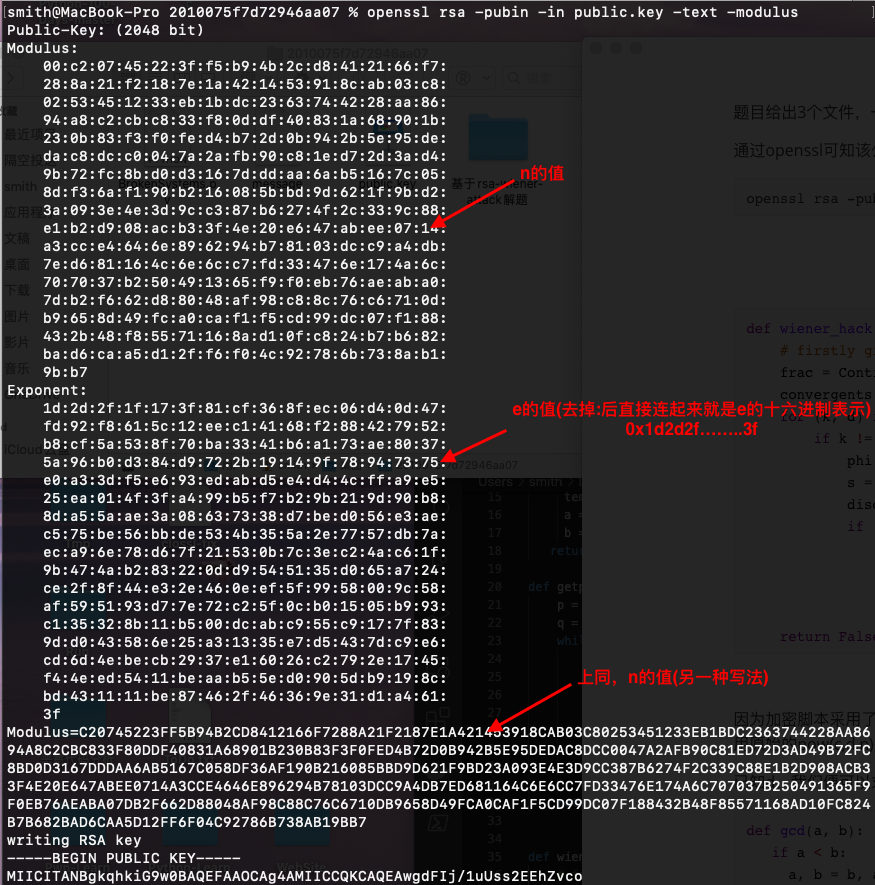

题目给出3个文件，一个加密脚本BrokenSystems.py，一个密文文件message，一个RSA公钥文件public.key。

通过openssl可知该公钥文件的e特别大，此时便存在rsa-wiener-attack攻击，通过此可以求出d。

```
openssl rsa -pubin -in public.key -text -modulus
```



通过rsa-wiener-attack求解d：

```python
from Crypto.PublicKey import RSA
import ContinuedFractions, Arithmetic

def wiener_hack(e, n):
    # firstly git clone https://github.com/pablocelayes/rsa-wiener-attack.git !
    frac = ContinuedFractions.rational_to_contfrac(e, n)
    convergents = ContinuedFractions.convergents_from_contfrac(frac)
    for (k, d) in convergents:
        if k != 0 and (e * d - 1) % k == 0:
            phi = (e * d - 1) // k
            s = n - phi + 1
            discr = s * s - 4 * n
            if (discr >= 0):
                t = Arithmetic.is_perfect_square(discr)
                if t != -1 and (s + t) % 2 == 0:
                    print("First: Hacked d.")
                    return d
    return False
n = 0xC20745223FF5B94B2CD8412166F7288A21F2187E1A421453918CAB03C80253451233EB1BDC2363744228AA8694A8C2CBC833F80DDF40831A68901B230B83F3F0FED4B72D0B942B5E95DEDAC8DCC0047A2AFB90C81ED72D3AD49B72FC8BD0D3167DDDAA6AB5167C058DF36AF190B216085BBD9D621F9BD23A093E4E3D9CC387B6274F2C339C88E1B2D908ACB33F4E20E647ABEE0714A3CCE4646E896294B78103DCC9A4DB7ED681164C6E6CC7FD33476E174A6C707037B250491365F9F0EB76AEABA07DB2F662D88048AF98C88C76C6710DB9658D49FCA0CAF1F5CD99DC07F188432B48F85571168AD10FC824B7B682BAD6CAA5D12FF6F04C92786B738AB19BB7
    e = 0x1d2d2f1f173f81cf368fec06d40d47fd92f8615c12eec14168f288427952b8cf5a538f70ba3341b6a173ae80375a96b0d384d9722b19149f78947375e0a33df5e693edabd5e4d44cffa9e525ea014f3fa499b5f7b29b219d90b88da55aae3a08637338d7bed056e3aec575be56bbde534b355a2e7757db7aeca96e78d67f21530b7c3ec24ac61f9b474ab283220dd9545135d065a724ce2f8f44e32e460eef5f9958009c58af595193d77e72c25f0cb01505b993c135328b11b500dcabc955c9177f839dd043586e25a31335e7d5437dc9e6cd6d4ebecb2937e16026c2792e1745f44eed5411beaab55ed0905db9198cbd431111be87462f46369e31d1a4613f

message = open('./message', 'r')
secret = message.read()
d = wiener_hack(e, n)
```

因为加密脚本采用了PKCS1_OAEP模式下的RSA加密，所以我们需要通过手动构造私钥进而才可以去解密密文。采用原始的pow(c,d,n)是无法正确的解密密文的。

已知d，我们便可以求出p和q。

```python
def gcd(a, b):
   if a < b:
     a, b = b, a
   while b != 0:
     temp = a % b
     a = b
     b = temp
   return a
 
def getpq(n,e,d):
	p = 1
	q = 1
	while p==1 and q==1:
		k = d * e - 1
		g = random.randint ( 0 , n )
		while p==1 and q==1 and k % 2 == 0:
			k /= 2
			y = pow(g,k,n)
			if y!=1 and gcd(y-1,n)>1:
				p = gcd(y-1,n)
				q = n/p
	return p,q
```

求出p和q之后，我们就可以采用PKCS1_OAEP模式构造私钥解密密文文件了。

```python
privkey = RSA.construct((long(n), long(e), long(d), long(p), long(q)))
key = PKCS1_OAEP.new(privkey)  

m = key.decrypt(secret)
print m
```

此时便可求出flag。

直接运行当前目录下的exp.py即可得到flag。